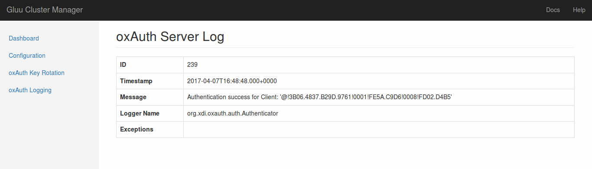

## Configuring Message Consumer

In clustered oxAuth setup, all server logs can be stored into ActiveMQ via [Message Consumer](https://github.com/GluuFederation/message-consumer) application.
To see those logs, we need to connect Cluster Manager to Message Consumer application.
Make sure that oxAuth are configured to [send the log to ActiveMQ](https://github.com/GluuFederation/message-consumer#configure-oxauth-server-logging).

Click __oxAuth Logging__ link in left sidebar menu, a new form will be displayed as shown below:

Note that if the URL is empty or unreachable, a warning message will be displayed at the top of the page.

### Message Consumer URL

The URL specifies full URL of Message Consumer application (REST API).
Message Consumer is installed by default when we install `gluu-cluster-mgr` package, and it is running at `http://localhost:9339`.

Save the URL by clicking __Save Config__ button.
If URL is reachable, then 2 new links will be displayed, __Audit Logs__ and __Server Logs__.
In this example, we will focus on server logs. Click the __Server Logs__ link.

### oxAuth Server Logs

If oxAuth logs are available in ActiveMQ, Cluster Manager will show them in paginated list.

Each log details can be viewed by clicking __View__ under the Details table header.
An example of server log details is shown below:

