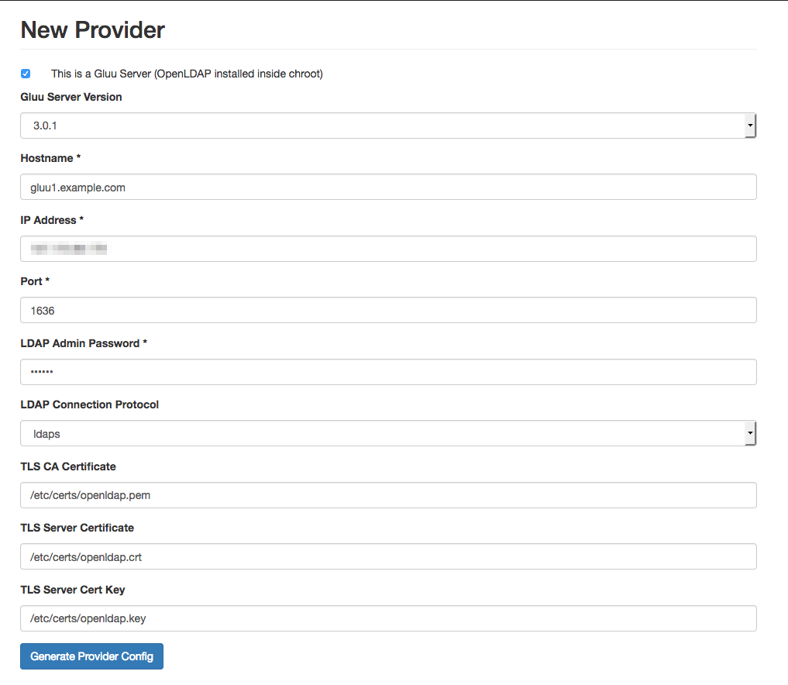
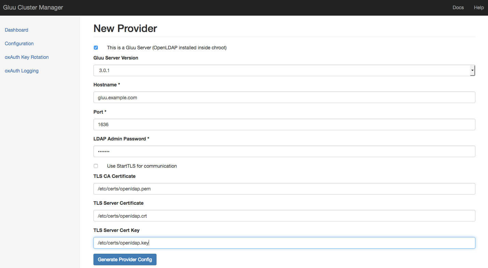

#Configuring replicatoin between Gluu CE server using Cluster Manager

## Pre-requisites

* **Gluu Server or LDIF Export** - This Gluu server or the LDIF export of the Gluu Server's contents would be used as the main source of LDAP data.
* **Provider Server** - Vanilla Linux server with Symas OpenLDAP installed and `symas-openldap.conf` configured. (1 for Delta-Syncrepl configuration and 2 for MirrorMode configuration)
* **Consumer Servers** - Vanilla Linux servers with Symas OpenLDAP installed and `symas-openldap.conf` configured. (As many servers as it is required)

## Delta-Syncrepl Mode

### First Steps
1. Open the Gluu Cluster Manager in the browser. The user is welcomed with a page which gives the options to create two types of clusters.
2. Click <kbd>Setup</kbd> from the Delta-Syncrepl box.
3. If this is the first run of the application, you will be redirected to the configuration page to setup the user dn and the password for the replication user which will be used across the cluster for replication. Configure it.

### Setting up the provider
4. Then you are redirected to "New Provider" page. Enter the details and submit the form.
    * **This is a Gluu Server** - Check this box if the server is a Gluu Server and the OpenLDAP is inside chroot container.
    * (Optional) **Gluu Server Version** - If the above checkbox is marked, then the version of Gluu-Server will have to be selected here.
    * **Hostname** - The hostname of the LDAP server
    * **IP Address** - The IP address of the LDAP server
    * **Port** - The port in which OpenLDAP is listening. Typical Gluu server would have `1636`
    * **LDAP Admin Password** - The password for LDAP server. For a Gluu server, this would be the password of Admin you created during installation via `setup.py`
    * **LDAP Connection Protocol** - OpenLDAP supports plain `ldap` and `ldaps` protocols. Gluu Server uses `ldaps`
    * **TLS CA Certificate** - If you are using SSL/TLS via `ldaps`, you will need to configure the TLS certificate locations. Enter location of CA cert on your LDAP server. For a typical Gluu server this would be `/etc/certs/openldap.pem` or `/etc/certs/openldap.crt` as it is self-signed.
    * **TLS Server Certificate** - The location of server certificate. For typical gluu server it is `/etc/certs/openldap.crt`
    * **TLS Server Key** - The location of server certificate's key. For typical gluu server it is `/etc/certs/openldap.key`
    
5. The app creates a slapd.conf using your data. You can add/change any configuration specific to your requirements and click <kdb>Setup Server</kbd>
6. The server is setup. Click <kbd>Go to Dashboard</kbd> once the setup is complete. In case the setup throws some error, make necessary changes in the server via ssh, then refresh the page or click the retry button at the bottom of the page to run the setup again.
7. The dashboard lists the server added. Click <kbd>Initialize</kbd> -> <kbd>Using Exported LDIF</kbd>.
8. Upload the `alldata.ldif` we exported from the Gluu Server. The cluster manager will import the LDIF data into the provider, and add the replication manager.
9. Once initialisation is complete an <kbd>Add Consumer</kbd> shows in the dashboard in the Actions box of the provider.

### Setting up the Consumers
10. Click <kbd>Add Consumer</kbd> next to the provider in the dashboard.
11. Fill in the details and submit the form for the consumer `slapd.conf` to be generated. As with the provider, make any special changes required and click Setup Server.
12. The consumer should be setup and configured. In case of errors, you can ssh into the server fix them and refresh the page to rerun the setup. If successfully setup, you would be asked to go to the Dashboard.

### Testing the replication
13. In the Dashboard, click <kbd>Start Test</kbd> under **Test Replication**. This adds a test entry to the provider, verifies the data is replicated to all its consumers, removes the data from the provider and ensures, it is removed from all the consumers as well.

## Mirror Mode
1. Open Cluster Manager in the browser. Click the <kbd>Setup</kbd> button in the MirroMode box.
    
2. If cluster manager hasn't been configured earlier, the user will be prompted to configure it before setting up the cluster. The values **Replication Manager DN** and the **Password** are mandatory. Other fields are optional. Enter the values and <kbd>Update Configuration</kbd>.
    
3. Now a **New Provider** can be added to the cluster. The fields are:
    * **This is a Gluu Server** - Check this box if the server is a Gluu Server and the OpenLDAP is inside chroot container.
    * (Optional) **Gluu Server Version** - If the above checkbox is marked, then the version of Gluu-Server will have to be selected here.
    * **Hostname** - The hostname of the LDAP server
    * **IP Address** - The IP address of the LDAP server
    * **Port** - The port in which OpenLDAP is listening. Typical Gluu server would have `1636`
    * **LDAP Admin Password** - The password for LDAP server. For a Gluu server, this would be the password of Admin you created during installation via `setup.py`
    * **LDAP Connection Protocol** - OpenLDAP supports plain `ldap` and `ldaps` protocols. Gluu Server uses `ldaps`
    * **TLS CA Certificate** - If you are using SSL/TLS via `ldaps`, you will need to configure the TLS certificate locations. Enter location of CA cert on your LDAP server. For a typical Gluu server this would be `/etc/certs/openldap.pem` or `/etc/certs/openldap.crt` as it is self-signed.
    * **TLS Server Certificate** - The location of server certificate. For typical gluu server it is `/etc/certs/openldap.crt`
    * **TLS Server Key** - The location of server certificate's key. For typical gluu server it is `/etc/certs/openldap.key`
    
4. Click <kbd>Generate Provider Config</kbd>. This generates the `slapd.conf` file that would be used to setup the OpenLDAP. If the organization/admin wishes to make any specific changes, they can do so here.
    
5. If `slapd.conf` is satisfactory, then clicking <kbd>Setup Server</kbd> would setup the server ready for cluster usage. Wait until the <kbd>Add Mirror</kbd> appears at the bottom of the page.
    
    
6. Click the <kbd>Add Mirror</kbd> button and repeat the above step 3 to step 5 to setup the mirror server.
7. Once both the servers are setup for replication, we can initialize replication by adding the replication user. Go to dashboard and Initialize **both the servers**
8. Click <kbd>Initialize</kbd> and select `Using existing data` if the provider LDAP already has the data (in case of gluu server), or `Using LDIF Data` if have some LDIF data backup that should be uploaded and used as the database.
    
    

## Troubleshooting

* For most part the web interface would log the errors encountered during the setup processes.
* In case of some consumer misbehaving or is misconfigured, remove the server from the 
dashboard using the <kbd>Remove</kbd> button and re-add the server using <kbd>Add Consumer</kbd>
* Before adding the consumer remove the data and provider certificate from the consumer server(Server 2).
    
    ` #service solserver stop`
    
    ` #rm -rf /opt/gluu/data`
    
    ` #rm /opt/symas/ssl/<provider.crt>`
    
!!!Note:

    It is not required to start LDAP manually, once the data and certificate is removed, 
    this task would be taken care by cluster mananger once the consumer is added the 
    cluster manager web application.